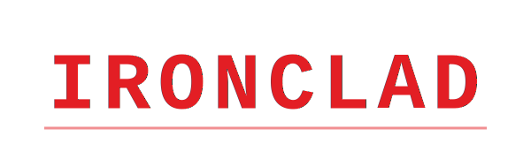

# IRONCLAD
**Enterprise Linux Security & Assurance Tool**

<p align="center">
  
</p>

## Overview
IRONCLAD is a modular, policy-driven security assurance framework designed for Linux systems. Unlike simple hardening scripts, IRONCLAD functions as a comprehensive audit tool suitable for SOC teams, DevSecOps pipelines, and compliance monitoring.

It performs read-only analysis of system configurations, network exposure, and identity management to calculate a risk score based on customizable policies (CIS Level 1/2). It features built-in baseline drift detection and can run as a persistent daemon for continuous security monitoring.

**Author:** [Syed Sameer ul Hassan](https://sameer.orildo.online)  
**Contact:** sameer@orildo.online

---

## Key Features

* **Modular Architecture:** Plugin-based engine allows for easy extension of audit capabilities without modifying the core logic.
* **Policy-as-Code:** All security checks are governed by external JSON policies. Support for CIS benchmarks and custom organizational standards.
* **Baseline & Drift Detection:** Cryptographically snapshots critical configurations and alerts on unauthorized changes (File Integrity Monitoring).
* **Risk Scoring Engine:** Calculates a quantitative security score (0-100) based on finding severity and weights.
* **SIEM Integration:** Native support for JSON output, optimized for ingestion by Splunk, ELK, or Wazuh.
* **Production Safe:** 100% Read-Only execution. IRONCLAD inspects but never modifies system configurations, guaranteeing zero downtime risks.

## Architecture

IRONCLAD is built on a segregated architecture to ensure stability and extensibility.

```text
[ CLI Wrapper ] -> [ Core Engine ] -> [ Policy Loader ]
                          |
                   [ Context Manager ]
                          |
          +---------------+---------------+
          |               |               |
   [ System Audit ] [ Net Audit ] [ Identity Audit ]
          |               |               |
          +-------+-------+-------+-------+
                  |
           [ Risk Scoring ]
                  |
           [ Reporting IO ]
# Ironclad
